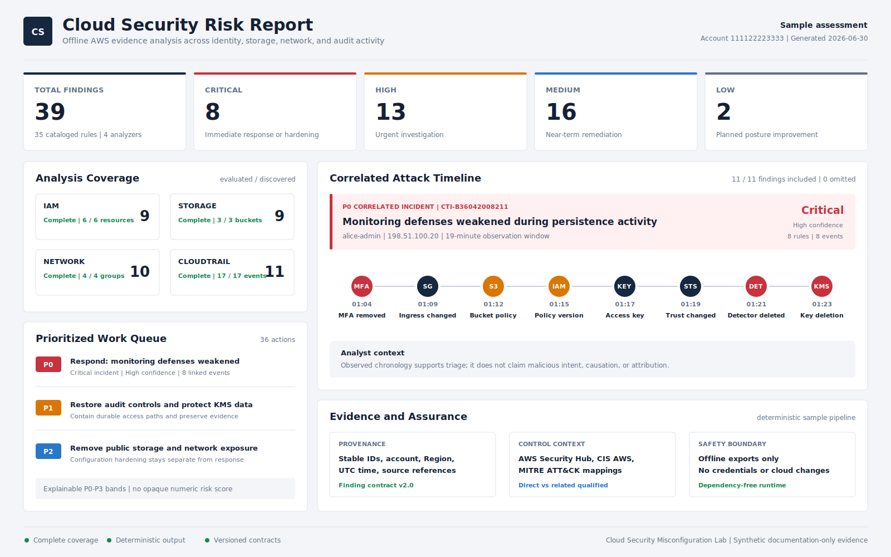

# Cloud Security Misconfiguration Lab

[](https://github.com/LLOYD-11/cloud_security_misconfiguration_lab/actions/workflows/ci.yml)


[](LICENSE)

An offline-first AWS security analysis lab that turns exported IAM, S3, EC2
security-group, and CloudTrail evidence into explainable findings, correlated
incidents, prioritized remediation, and a chronological attack timeline.

The runtime never authenticates to AWS and never changes cloud resources. Native
AWS-shaped exports are normalized into stable offline contracts so the same
detection logic can be tested, explained, and reproduced without cloud
credentials or charges.

| At a Glance | Evidence |
| --- | --- |
| Security scope | IAM, S3, EC2 security groups, and CloudTrail |
| Detection depth | 35 cataloged rules with qualified AWS Security Hub CSPM, CIS AWS Foundations, and MITRE ATT&CK mappings |
| Deterministic sample | 39 findings, 2 incidents, 36 remediation actions, and 11 timeline entries |
| Engineering assurance | 375 tests; 95.51% statement and 89.02% branch coverage; Python 3.10-3.13 CI |
| Safety boundary | Offline files only; zero runtime dependencies; no credentials and no cloud writes |

## Quick Start

Run the complete deterministic sample pipeline from the repository root:

```bash
python3 -m cloud_security_lab demo --report-date 2026-06-30
```

This writes versioned findings, coverage summaries, incidents, remediation,
timeline, and report artifacts under `reports/generated/`. The final report must
match the committed
[`cloud_security_report_sample.md`](reports/cloud_security_report_sample.md)
byte-for-byte.

Install the project in a virtual environment to expose the `cloud-security-lab` command:

```bash
python3 -m venv .venv
.venv/bin/python -m pip install --no-deps -e .
.venv/bin/cloud-security-lab --help
```

## Sample Report

[](reports/cloud_security_report_sample.md)

The preview shows real output from the bundled synthetic evidence: complete
coverage across all four modules, a critical eight-event `alice-admin`
correlation, and an explainable P0-P3 remediation queue. Open the
[full sample report](reports/cloud_security_report_sample.md) for finding
evidence, qualified control mappings, analyst context, and recommended actions.

## Demo Walkthrough

| Step | Pipeline Behavior | Primary Output |
| ---: | --- | --- |
| 1 | Normalize simplified or native AWS-shaped exports into stable offline environments. | Canonical evidence and analysis coverage |
| 2 | Apply 35 cataloged rules while preserving provenance, confidence, and source references. | Four versioned findings files |
| 3 | Correlate CloudTrail signals by account, actor, source, and bounded time window. | Incidents and chronological timeline |
| 4 | Separate incident response from configuration hardening and render the reviewer-facing result. | P0-P3 plan and consolidated report |

The [five-minute demo guide](docs/demo-walkthrough.md) provides a concise
presentation path through the CLI, attack sequence, remediation decisions, and
engineering evidence.

## Tested Results

| Quality Gate | Verified Result |
| --- | --- |
| Automated tests | 375 unit, regression, integration, CLI, schema, compatibility, and benchmark tests pass |
| Coverage | 5,536/5,796 statements (95.51%) and 2,067/2,322 branches (89.02%) |
| Rule benchmark | 78/78 exact functional cases and 4/4 malformed native inputs rejected |
| Scale benchmark | 8/8 deterministic profiles pass across 100 to 10,000 inputs |
| Supported Python | GitHub Actions exercises every minor from Python 3.10 through 3.13 |
| Distribution | Wheel and sdist build; installed-wheel demo and packaged benchmark pass |

Timing is measured but deliberately not used as a CI threshold. Exact outputs,
bounded finding amplification, repeated-run equality, structural operation
bounds, and calibrated memory ceilings provide more stable regression evidence.
See [Benchmarking and resilience](docs/benchmarking.md).

## What I Learned

- Evidence completeness must be reported independently from finding count.
  Zero findings cannot be treated as proof that collection was complete.
- Native AWS response parsing belongs at an adapter boundary. Keeping detector
  inputs stable made deeper rules possible without coupling them to collection
  formats.
- Correlation and chronology are useful only when their claims stay narrow.
  The project preserves actor, source, event, and resource evidence while
  explicitly refusing to infer intent, causation, or attribution.
- Deterministic IDs, versioned contracts, golden artifacts, and machine-readable
  benchmarks turn a security script into a reviewable engineering system.

## Modules

### Module 1: IAM Policy Analyzer

The first module analyzes sample IAM users, identity policies, and trust policies for common cloud security risks:

- Full, service, and partial action wildcards such as `*`, `iam:*`, and `iam:Get*`
- Unscoped resources and broad `NotAction` or `NotResource` complements
- Administrator-style access
- Broad S3 permissions
- Sensitive user permissions without an MFA policy guard
- Public and cross-account role trust, with recognized trust-condition guardrails
- Direct and group policy exposure
- Long-lived and stale credentials, root credentials, and ineffective permissions boundaries

The analyzer produces terminal findings and exports structured JSON evidence for reporting.

IAM input can use either the documented simplified environment contract or native AWS `GetAccountAuthorizationDetails` plus credential-report exports. Native input preserves direct policies, IAM groups and members, role trust, permissions boundaries, console-password posture, root credentials, and access-key age and usage before applying the same detection rules.

Rule catalog:

| Rule | Risk Pattern |
| --- | --- |
| `IAM-001` | Administrator-style `Action "*"` on `Resource "*"` |
| `IAM-002` | Full, service, or partial wildcard action |
| `IAM-003` | Unscoped wildcard resource |
| `IAM-004` | Broad S3 write permission |
| `IAM-005` | Sensitive action without MFA condition |
| `IAM-006` | Console-enabled user without MFA |
| `IAM-007` | Long-lived access key |
| `IAM-008` | Public or cross-account role trust |
| `IAM-009` | Broad allow using `NotAction` |
| `IAM-010` | Broad allow using `NotResource` |
| `IAM-011` | Stale active access key |
| `IAM-012` | Stale console password |
| `IAM-013` | Active root access key |
| `IAM-014` | Root password without MFA |
| `IAM-015` | Unrestricted permissions boundary |

### Module 2: Risk Report Generator

The report generator reads one or more finding JSON files and creates a consolidated Markdown risk report. Optional analysis summaries replace finding-only module counts with evaluated and discovered resource counts, coverage status, skipped evidence, and normalization warnings. Findings and correlated incidents also produce an explainable P0-P3 work queue that separates immediate response from permanent configuration hardening. Timestamped CloudTrail findings form an evidence-preserving timeline, while incident sections explain observed sequence and triage context without presenting chronology as proof of intent or causation.

Artifact-derived text crosses a documented
[Markdown report-integrity boundary](docs/report-integrity.md). Context-specific
renderers preserve headings, lists, tables, code spans, and links even when
model-valid input contains Markdown control characters or embedded line breaks.

Each analyzer can write a versioned analysis summary through `--summary-output`. A summary records `complete`, `partial`, or `empty` coverage independently from the finding count, so zero findings no longer imply that evidence was complete. See [Analysis coverage](docs/analysis-coverage.md) for the status and counting rules.

All analyzers should emit the same finding schema:

| Field | Purpose |
| --- | --- |
| `finding_id` | Deterministic identity derived from rule, resource, provenance, and source evidence |
| `rule_id` | Stable detection rule identifier |
| `severity` | `critical`, `high`, `medium`, `low`, or `info` |
| `confidence` | How directly the supplied evidence supports the rule condition |
| `module` | Analyzer module name, such as `iam` |
| `category` | Security domain, such as `identity-and-access` |
| `account_id` | Evidence account, or `unknown` when it cannot be established |
| `region` | Evidence Region, `global`, or `unknown` |
| `observed_at` | UTC evidence observation time, or `null` when unavailable |
| `resource_type` | Affected resource type |
| `resource_id` | Affected resource name or identifier |
| `evidence_references` | Structured pointers to policy statements, rules, credential rows, or events |
| `title` | Short finding title |
| `evidence` | Concrete observed evidence |
| `impact` | Why the issue matters |
| `remediation` | Recommended fix |
| `references` | Optional reference links |
| `metadata` | Optional module-specific details |

New exports use the strict
[`findings-v2.0`](schemas/findings-v2.0.schema.json) contract. The loader also
accepts versioned v1 files and migrates unavailable provenance to explicit
`unknown` or `null` values; unversioned lists remain rejected. The report
validates each built-in finding's rule, module, severity, and non-unknown
confidence against the versioned [detection rule catalog](docs/rule-catalog.md),
then summarizes qualified control mappings. Unknown custom rule IDs remain
report-compatible and are marked as not cataloged.

The prioritizer groups equivalent remediation without losing finding or resource
counts, preserves incident response as separate work, and raises configuration
linked to correlated activity through published rules rather than a hidden risk
score. It can write a versioned JSON plan through `--remediation-output`; see
[Remediation prioritization](docs/remediation-prioritization.md).

The timeline includes only CloudTrail findings with valid UTC times and event
IDs, records every omission, and links an entry to an incident only when rule,
resource, and event ID agree. It can write a versioned JSON artifact through
`--timeline-output`; see [Attack timeline](docs/attack-timeline.md).

### Module 3: Storage Exposure Analyzer

The storage analyzer checks sample S3-style bucket configurations for common exposure and resilience risks:

- Incomplete S3 Block Public Access controls
- Public ACL grants that remain effective under Block Public Access and Object Ownership
- Bucket policies with unrestricted `Principal: "*"` or broad `NotPrincipal`
- Policy conditions that do not create an AWS-recognized fixed-value access boundary
- ACL-enabled Object Ownership modes
- Missing an explicit bucket encryption configuration beyond the S3 SSE-S3 baseline
- Missing or suspended versioning

Storage input can use either the simplified environment contract or a versioned native evidence bundle containing `ListBuckets`, account and bucket Public Access Block, Object Ownership, ACL, policy, default encryption, and versioning responses.

Public ACL and bucket-policy exposure findings account for `BucketOwnerEnforced`, effective `IgnorePublicAcls`, and effective `RestrictPublicBuckets` rather than reporting blocked access paths as active exposure. Wildcard-principal policies are treated as non-public only when a supported positive condition operator fixes access to an AWS-recognized organization, account, source ARN, VPC, VPC endpoint, data access point, or sufficiently narrow source network.

In this module, non-public means that a statement is constrained under the S3 Block Public Access model; it does not mean that the named external account, organization, network, or service is automatically trusted.

Rule catalog:

| Rule | Risk Pattern |
| --- | --- |
| `STO-001` | S3 public access block is incomplete |
| `STO-002` | Bucket ACL grants public access |
| `STO-003` | Bucket policy allows an effectively public principal |
| `STO-004` | Bucket lacks an explicit encryption configuration |
| `STO-005` | Bucket versioning is not enabled |
| `STO-006` | Bucket ACLs remain enabled by Object Ownership |

### Module 4: Network Configuration Analyzer

The network analyzer checks sample security group configurations for risky network exposure:

- Protocol-aware exposure across 20 remote-administration, database, data-service, and control-plane endpoints
- All inbound ports open to the internet
- Unrestricted outbound traffic to the internet
- Optional, direction-specific reachability evidence that distinguishes a permitted security-group path from reported end-to-end connectivity

Network input can use either the simplified environment contract or a complete native EC2 `DescribeSecurityGroups` response. Native normalization validates account, VPC, security-group, peering, protocol, port, and CIDR evidence before applying the same rules. Prefix-list and security-group targets are preserved with visible warnings but are not resolved into public reachability.

An optional versioned reachability context can mark ingress and egress as `reachable`, `not_reachable`, or `inconclusive`, with an explicit scope, assessment method, timestamp, evidence, and related resource IDs. Missing context is recorded as `not_assessed`. A valid `not_reachable` assessment lowers severity by one level but never suppresses the permissive configuration finding; `reachable`, `inconclusive`, and `not_assessed` retain the service default. The lab validates and reports this supplied context but does not independently reproduce AWS path analysis.

Rule catalog:

| Rule | Risk Pattern |
| --- | --- |
| `NET-001` | Sensitive service port permits traffic from an internet-wide or broad public CIDR |
| `NET-002` | All inbound ports are open to the internet |
| `NET-003` | Unrestricted outbound traffic is allowed |

See the [Network analyzer documentation](network_analyzer/README.md) for the complete service catalog and reachability semantics.

### Module 5: CloudTrail-Style Event Detector

The CloudTrail detector checks sample audit events for suspicious cloud API activity:

- Root account console login
- MFA device disabled or deleted
- Successful security group authorization changes
- Successful bucket access changes that can weaken controls
- Successful IAM policy changes that can add access
- Repeated API failures from one actor and source
- IAM user console logins explicitly recorded without MFA
- Persistent credential creation and role trust-policy changes
- Audit or threat-detection controls being disabled
- KMS keys being disabled or scheduled for deletion

Change findings require both a supported API name and its expected AWS
`eventSource`. Identical CloudTrail events with the same `eventID` are analyzed
once; conflicting records sharing an ID stop analysis before findings,
incidents, or coverage summaries are produced. Failed API calls remain
available to the failure-spike detector but are not reported as successful
configuration changes.

CloudTrail input can use either the simplified event contract or one or more native `Records` log files in JSON or gzip format. Native normalization validates version 1.x records, UTC timestamps, identity and account context, and event GUIDs before merging files.

The `CLD-006` failure-spike search uses a near-linear bounded-window scan after
stable per-group sorting. Exact old/new finding equivalence, edge semantics, and
a deterministic 10,000-point structural performance bound are documented in
[CloudTrail failure-window performance](docs/detection-performance.md).

Rule catalog:

| Rule | Risk Pattern |
| --- | --- |
| `CLD-001` | Root account console login |
| `CLD-002` | MFA device disabled or deleted |
| `CLD-003` | Security group configuration changed |
| `CLD-004` | Bucket access policy changed |
| `CLD-005` | IAM policy configuration changed |
| `CLD-006` | Repeated API failures |
| `CLD-007` | IAM user console login without MFA |
| `CLD-008` | Persistent cloud credential created |
| `CLD-009` | Role trust policy changed |
| `CLD-010` | Audit or threat-detection control disabled |
| `CLD-011` | KMS key disabled or scheduled for deletion |

The detector also correlates eligible findings from the same actor and source into versioned incidents. The default 30-minute window, qualification rules, deterministic IDs, confidence model, and limitations are documented in [CloudTrail incident correlation](docs/incident-correlation.md). The reporting pipeline separately converts timestamped findings into a chronological [attack timeline](docs/attack-timeline.md), preserving aggregate failure windows and explicit evidence gaps.

## Unified CLI

Every simplified JSON file crosses the same dependency-free
[runtime validation boundary](docs/simplified-input-validation.md) before
analysis. Errors identify the first invalid field with a stable JSON-style path;
the unified and compatibility CLIs therefore reject malformed nested evidence
consistently. All external evidence and report artifacts also cross measured
[input resource limits](docs/input-resource-limits.md) for bytes, gzip
decompression, JSON nodes and depth, resource counts, and file counts.

Run one analyzer:

```bash
python3 -m cloud_security_lab analyze iam \
  sample_data/iam/sample_iam_environment.json \
  --output reports/generated/iam_findings.json \
  --summary-output reports/generated/iam_analysis_summary.json
```

Analyze native AWS IAM exports without connecting the lab to an account:

```bash
python3 -m cloud_security_lab analyze iam \
  sample_data/aws/iam/account_authorization_details.json \
  --input-format aws \
  --credential-report sample_data/aws/iam/credential_report.csv \
  --as-of 2026-06-30 \
  --observed-at 2026-06-30T00:00:00Z \
  --normalized-output reports/generated/normalized_iam_environment.json \
  --output reports/generated/iam_findings.json \
  --summary-output reports/generated/iam_analysis_summary.json
```

See [Native AWS inputs](docs/native-aws-inputs.md) for evidence collection,
validation behavior, limitations, and the machine-readable provenance manifest
for every bundled AWS-shaped fixture.

Analyze the bundled native AWS S3 evidence:

```bash
python3 -m cloud_security_lab analyze storage \
  sample_data/aws/s3/s3_security_evidence_bundle.json \
  --input-format aws \
  --normalized-output reports/generated/normalized_storage_environment.json \
  --output reports/generated/storage_findings.json \
  --summary-output reports/generated/storage_analysis_summary.json
```

Analyze the bundled native EC2 security-group response:

```bash
python3 -m cloud_security_lab analyze network \
  sample_data/aws/ec2/describe_security_groups.json \
  --input-format aws \
  --reachability-context sample_data/aws/ec2/network_reachability_context.json \
  --region ap-southeast-2 \
  --normalized-output reports/generated/normalized_network_environment.json \
  --output reports/generated/network_findings.json \
  --summary-output reports/generated/network_analysis_summary.json
```

Analyze the bundled native CloudTrail JSON and gzip files:

```bash
python3 -m cloud_security_lab analyze cloudtrail \
  sample_data/aws/cloudtrail/111122223333_CloudTrail_20260630T0200Z_part1.json \
  sample_data/aws/cloudtrail/111122223333_CloudTrail_20260630T0300Z_part2.json.gz \
  --input-format aws \
  --normalized-output reports/generated/normalized_cloudtrail_environment.json \
  --output reports/generated/cloudtrail_findings.json \
  --incidents-output reports/generated/cloudtrail_incidents.json \
  --summary-output reports/generated/cloudtrail_analysis_summary.json
```

Inspect the complete built-in rule catalog or filter it by analyzer:

```bash
python3 -m cloud_security_lab catalog
python3 -m cloud_security_lab catalog --module storage --format json
```

The catalog records each rule's allowed severities, evidence-to-rule confidence,
confidence basis, and `direct` or `related` mappings to AWS Security Hub CSPM,
MITRE ATT&CK, and a verified CIS AWS Foundations Benchmark crosswalk. The
committed [catalog reference](docs/rule-catalog.md) is generated from the same
JSON used by the analyzers and report generator.

Merge one or more versioned finding files:

```bash
python3 -m cloud_security_lab report \
  --findings reports/generated/iam_findings.json \
  --findings reports/generated/storage_findings.json \
  --findings reports/generated/network_findings.json \
  --findings reports/generated/cloudtrail_findings.json \
  --incidents reports/generated/cloudtrail_incidents.json \
  --analysis-summary reports/generated/iam_analysis_summary.json \
  --analysis-summary reports/generated/storage_analysis_summary.json \
  --analysis-summary reports/generated/network_analysis_summary.json \
  --analysis-summary reports/generated/cloudtrail_analysis_summary.json \
  --report-date 2026-06-30 \
  --remediation-output reports/generated/remediation_plan.json \
  --timeline-output reports/generated/attack_timeline.json \
  --output reports/generated/cloud_security_report.md
```

The installed `cloud-security-lab` command exposes the same `analyze`, `report`,
`catalog`, and `demo` subcommands. The explicit report date makes sample output
reproducible; omit `--report-date` to use the current local date.

## Compatibility Entrypoints

The original module scripts remain supported:

```bash
python3 iam_analyzer/analyzer.py sample_data/iam/sample_iam_environment.json
python3 storage_analyzer/analyzer.py sample_data/storage/sample_storage_environment.json
python3 network_analyzer/analyzer.py sample_data/network/sample_network_environment.json
python3 cloudtrail_detector/detector.py sample_data/cloudtrail/sample_cloudtrail_events.json
```

## Project Documentation

- [Upgrade roadmap](ROADMAP.md)
- [Upgrade traceability](docs/traceability.md)
- [System architecture](docs/architecture.md)
- [Design decisions](docs/design-decisions.md)
- [Version 2.1.1 release notes](docs/release-v2.1.1.md)
- [Version 2.1.0 release notes](docs/release-v2.1.0.md)
- [Version 2.0.0 release notes](docs/release-v2.0.0.md)
- [Five-minute demo walkthrough](docs/demo-walkthrough.md)
- [Data contracts](docs/data-contracts.md)
- [Simplified-input runtime validation](docs/simplified-input-validation.md)
- [Input resource limits](docs/input-resource-limits.md)
- [Detection rule catalog](docs/rule-catalog.md)
- [Remediation prioritization](docs/remediation-prioritization.md)
- [Attack timeline](docs/attack-timeline.md)
- [Analysis coverage](docs/analysis-coverage.md)
- [Native AWS inputs](docs/native-aws-inputs.md)
- [CloudTrail failure-window performance](docs/detection-performance.md)
- [Benchmarking and resilience](docs/benchmarking.md)
- [Supply-chain controls](docs/supply-chain.md)
- [Documentation quality gates](docs/documentation-quality.md)
- [Engineering checks](docs/engineering.md)
- [Known limitations](docs/known-limitations.md)
- [Change log](CHANGELOG.md)

## Requirements

Runtime: Python 3.10 or later. The analyzers and unified CLI have no third-party runtime dependencies.

Development and contract checks use the universal, SHA-256-locked transitive
environment in `requirements-dev.lock`:

```bash
.venv/bin/python -m pip install --require-hashes -r requirements-dev.lock
.venv/bin/python -m pip install --no-build-isolation --no-deps -e .
.venv/bin/python -m pip check
```

See [Supply-chain controls](docs/supply-chain.md) for the lock update and
immutable GitHub Actions verification process.

## Quality Checks

```bash
mkdir -p reports/generated
.venv/bin/ruff check .
.venv/bin/mypy cloud_analysis cloud_benchmarks cloud_security_lab cloud_findings cloud_inputs cloud_incidents cloud_remediation cloud_rules cloud_timeline iam_analyzer storage_analyzer network_analyzer cloudtrail_detector report_generator tools
.venv/bin/pymarkdown --strict-config scan --respect-gitignore .
.venv/bin/python -m tools.check_markdown_links internal
.venv/bin/python -m tools.check_markdown_links external
.venv/bin/coverage run -m unittest discover
.venv/bin/coverage report
.venv/bin/coverage json -o reports/generated/coverage.json
.venv/bin/python -m cloud_benchmarks.coverage_gate reports/generated/coverage.json
.venv/bin/python -m cloud_benchmarks.runner
```

The benchmark gate covers all 35 built-in rules through 78 exact functional
cases plus eight deterministic scale profiles. Coverage is enforced separately
at 90% for statements and 85% for branches. GitHub Actions runs the quality,
benchmark, and deterministic pipeline on Python 3.10, 3.11, 3.12, and 3.13,
and builds the distributions on Python 3.13.

## Project Structure

```text
cloud_security_misconfiguration_lab/
├── .github/workflows/
│   ├── ci.yml
│   └── release.yml
├── README.md
├── ROADMAP.md
├── CHANGELOG.md
├── pyproject.toml
├── requirements-dev.lock
├── tools/
│   └── check_markdown_links.py
├── cloud_security_lab/
│   ├── __main__.py
│   ├── analysis.py
│   ├── cli.py
│   └── normalizers/
│       ├── cloudtrail.py
│       ├── common.py
│       ├── ec2.py
│       ├── iam.py
│       ├── network_context.py
│       └── s3.py
├── cloud_benchmarks/
│   ├── benchmark-manifest-v1.0.json
│   ├── coverage_gate.py
│   ├── manifest_builder.py
│   ├── profiles.py
│   └── runner.py
├── cloud_analysis/
│   └── summary.py
├── cloud_findings/
│   └── finding.py
├── cloud_inputs/
│   ├── bounds.py
│   ├── test_bounds.py
│   ├── validation.py
│   └── test_validation.py
├── cloud_incidents/
│   └── incident.py
├── cloud_remediation/
│   └── plan.py
├── cloud_rules/
│   ├── catalog.py
│   └── rules-v1.0.json
├── cloud_timeline/
│   ├── timeline.py
│   └── test_timeline.py
├── cloudtrail_detector/
│   ├── correlation.py
│   ├── detector.py
│   ├── README.md
│   └── test_detector.py
├── iam_analyzer/
│   ├── analyzer.py
│   ├── README.md
│   └── test_analyzer.py
├── network_analyzer/
│   ├── analyzer.py
│   ├── README.md
│   └── test_analyzer.py
├── report_generator/
│   ├── generate_report.py
│   ├── README.md
│   └── test_generate_report.py
├── reports/
│   └── cloud_security_report_sample.md
├── schemas/
│   ├── analysis-summary-v1.0.schema.json
│   ├── attack-timeline-v1.0.schema.json
│   ├── aws-fixture-manifest-v1.0.schema.json
│   ├── benchmark-manifest-v1.0.schema.json
│   ├── benchmark-results-v1.0.schema.json
│   ├── findings-v1.0.schema.json
│   ├── findings-v2.0.schema.json
│   ├── incidents-v1.0.schema.json
│   ├── remediation-plan-v1.0.schema.json
│   ├── rule-catalog-v1.0.schema.json
│   ├── aws-cloudtrail-records-v1.0.schema.json
│   ├── aws-iam-authorization-details-v1.0.schema.json
│   ├── aws-ec2-describe-security-groups-v1.0.schema.json
│   ├── network-reachability-context-v1.0.schema.json
│   ├── aws-s3-evidence-bundle-v1.0.schema.json
│   └── *-environment-v1.0.schema.json
├── sample_data/
│   ├── aws/fixture-manifest-v1.0.json
│   ├── aws/cloudtrail/
│   │   ├── 111122223333_CloudTrail_20260630T0200Z_part1.json
│   │   └── 111122223333_CloudTrail_20260630T0300Z_part2.json.gz
│   ├── aws/iam/
│   │   ├── account_authorization_details.json
│   │   └── credential_report.csv
│   ├── aws/ec2/
│   │   ├── describe_security_groups.json
│   │   └── network_reachability_context.json
│   ├── aws/s3/
│   │   └── s3_security_evidence_bundle.json
│   ├── cloudtrail/
│   │   └── sample_cloudtrail_events.json
│   ├── iam/
│   │   └── sample_iam_environment.json
│   ├── network/
│   │   └── sample_network_environment.json
│   └── storage/
│       └── sample_storage_environment.json
├── storage_analyzer/
│   ├── analyzer.py
│   ├── README.md
│   └── test_analyzer.py
├── docs/
│   ├── analysis-coverage.md
│   ├── attack-timeline.md
│   ├── architecture.md
│   ├── benchmarking.md
│   ├── data-contracts.md
│   ├── demo-walkthrough.md
│   ├── design-decisions.md
│   ├── engineering.md
│   ├── incident-correlation.md
│   ├── input-resource-limits.md
│   ├── known-limitations.md
│   ├── native-aws-inputs.md
│   ├── remediation-prioritization.md
│   ├── release-v2.0.0.md
│   ├── release-v2.1.0.md
│   ├── release-v2.1.1.md
│   ├── rule-catalog.md
│   ├── simplified-input-validation.md
│   ├── traceability.md
│   └── assets/
│       └── report-preview.svg
├── tests/
│   ├── test_benchmarks.py
│   ├── test_contracts.py
│   ├── test_legacy_clis.py
│   ├── test_markdown_links.py
│   └── test_supply_chain.py
├── LICENSE
└── .gitignore
```

## Safety Boundary

This project operates on offline sample data. Do not connect future collectors to a real cloud account unless the account is owned by you or you have explicit permission to assess it.
