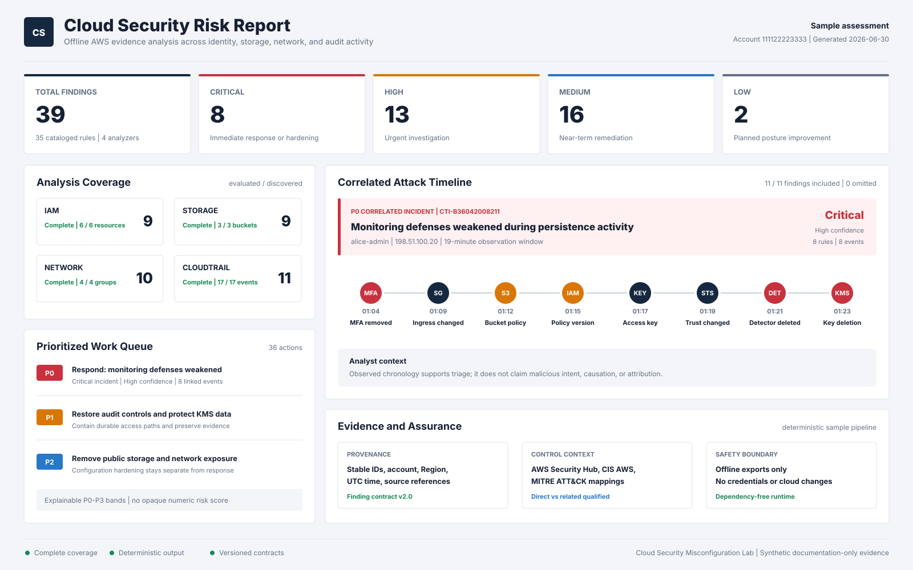

# Cloud Security Misconfiguration Lab

[](https://github.com/LLOYD-11/cloud_security_misconfiguration_lab/actions/workflows/ci.yml)


[](LICENSE)

An offline-first AWS security analysis project that turns exported IAM, S3,
EC2 security-group, and CloudTrail evidence into explainable findings,
correlated incidents, prioritized remediation, and a chronological attack
timeline.

The analyzer runtime never authenticates to AWS or changes cloud resources.
Native AWS-shaped exports cross explicit validation and normalization boundaries
so the same detection logic can be tested, reviewed, and reproduced without
cloud credentials or runtime package dependencies.

| At a Glance | Evidence |
| --- | --- |
| Public release | [`v2.2.1`](https://github.com/LLOYD-11/cloud_security_misconfiguration_lab/releases/tag/v2.2.1) |
| Security scope | 35 cataloged rules: 15 IAM, 6 S3, 3 network, and 11 CloudTrail |
| Deterministic sample | 39 findings, 2 incidents, 36 remediation actions, and 11 timeline entries |
| Engineering assurance | Python 3.10-3.13 CI, 90% statement and 85% branch gates, exact functional and scale benchmarks |
| Frozen evaluation | 77 TP, 2 FP, 1 FN, 90 TN, F1 `0.9809`; preregistered acceptance **not met** |
| Analyzer boundary | Offline files only; no cloud writes, credentials, or third-party runtime packages |
| Real-system status | Bounded AWS protocol prepared; no live result claimed yet |

## Why This Project

A cloud scanner can produce a long alert list while hiding whether its input was
complete, how provider data became a finding, or which claims were actually
measured. This project asks a narrower question: can exported AWS evidence be
analyzed through a deterministic pipeline whose assumptions, provenance,
failures, and evaluation remain inspectable?

The goal is not to replace AWS Security Hub, IAM Access Analyzer, Prowler, or a
production SIEM. The goal is to demonstrate security reasoning and engineering
discipline at the boundary between cloud evidence, detection logic, and
reviewer-facing output.

## System

```text
Simplified or AWS-shaped exports
              |
       validate + normalize
              |
 IAM | S3 | network | CloudTrail
              |
       shared Finding contract
              |
 coverage | incidents | remediation | timeline
              |
      deterministic Markdown report
```

| Module | Selected Analysis |
| --- | --- |
| IAM | Wildcard and administrative access, MFA guards, trust policies, credentials, and permissions boundaries |
| S3 | Block Public Access, ACL and policy exposure, Object Ownership, encryption posture, and versioning |
| EC2 security groups | Public sensitive ports, all-port ingress, broad egress, and optional reachability context |
| CloudTrail | Root and identity changes, security-control changes, failure bursts, and bounded incident correlation |

Every analyzer emits the same versioned finding model. Derived artifacts retain
evidence references and deterministic identities without changing the original
finding. See the [architecture](docs/architecture.md) and
[rule catalog](docs/rule-catalog.md) for the complete design and rule semantics.

## Run It In One Minute

From the repository root with Python 3.10 or later:

```bash
python3 -m cloud_security_lab demo --report-date 2026-06-30
```

Expected summary:

```text
IAM: 9 findings
Storage: 9 findings
Network: 10 findings
CloudTrail: 11 findings
CloudTrail incidents: 2
Prioritized remediation: 36 actions
Attack timeline: 11 entries
Combined report: 39 findings
```

Artifacts are written under `reports/generated/`. The final report must match
the committed sample byte-for-byte. Detailed analyzer, catalog, report, native
input, and compatibility commands are in the
[command-line reference](docs/cli-reference.md).

## Inspect Generated Output

[](reports/cloud_security_report_sample.md)

The [full sample report](reports/cloud_security_report_sample.md) contains the
39 synthetic findings, evidence coverage, a critical eight-event correlation,
P0-P3 remediation, and an 11-entry timeline. It repeatedly distinguishes
observed configuration and API evidence from intent, causation, attribution,
and proven reachability.

## Evidence That Matters

| Question | Inspectable Answer |
| --- | --- |
| Does the software pass its own engineering gates? | A measured development checkpoint passed 447 tests, 92.82% statement coverage, 86.41% branch coverage, 78/78 functional cases, 4/4 malformed-input cases, and 8/8 scale profiles across Python 3.10-3.13. |
| Was accuracy measured separately from development tests? | Candidate `2.1.1` was frozen before a 32-case, 42-file, 176-assertion synthetic corpus was executed. |
| What was the result? | 77 TP, 2 FP, 1 FN, and 90 TN produced precision `0.9747`, recall `0.9872`, and F1 `0.9809`. |
| Did it meet the registered target? | No. Storage precision was `0.8824`, and two outputs lacked predeclared decision keys. The failed acceptance decision is preserved. |
| Was an external tool comparison bounded? | Five exact-overlap Prowler predicates produced 24/24 matching decisions. Partial and absent Prowler or Sigma relationships were excluded from agreement metrics. |
| Can the published result be replayed? | The replay restores the frozen candidate in an isolated checkout and verifies the canonical failed result without substituting later code. |

The [research question and claim register](docs/research-question.md) defines
exactly what these numbers support. The
[technical case study](docs/technical-case-study.md) explains the method,
results, failure analysis, validity threats, and future work. Raw decisions,
intervals, disagreements, and acceptance checks remain in the
[evaluation report](docs/evaluation-report.md).

### What The Evaluation Exposed

- `IAM-005` missed a non-strict `BoolIfExists=true` MFA condition because the
  candidate ignored condition-operator semantics.
- Two storage cases omitted applicable `STO-001` decision keys, exposing a
  defect in the evaluation decision universe rather than a hidden analyzer
  mismatch.
- The registered reachability-context experiment had no eligible frozen case
  and was reported as not estimable.

Current development fixes the IAM defect as a regression. It does not replace
candidate `2.1.1`, alter the frozen corpus or runner, or improve the published
score after disclosure.

## Reviewer Paths

| Available Time | Start Here | Continue With |
| --- | --- | --- |
| 60 seconds | [One-page application summary](docs/application-summary.md) | [Sample report](reports/cloud_security_report_sample.md) |
| 5 minutes | [Demo walkthrough](docs/demo-walkthrough.md) | [Contribution and engineering reflection](docs/contribution-and-reflection.md) |
| Technical review | [Technical case study](docs/technical-case-study.md) | [Architecture](docs/architecture.md), [design decisions](docs/design-decisions.md), and [traceability](docs/traceability.md) |
| Reproduction | [Command-line reference](docs/cli-reference.md) | [Engineering checks](docs/engineering.md) and [evaluation protocol](docs/evaluation-protocol.md) |
| Real AWS boundary | [Prepared real-system demo](docs/real-system-demo.md) | Execution remains pending an authorized disposable account and sanitized teardown evidence. |

## Authorship And Assistance

This is a Lloyd-directed, AI-assisted portfolio project. Lloyd selected and
approved the problem, safety boundary, scope, quality standard, evidence policy,
and publication decisions. OpenAI Codex materially assisted architecture
exploration, implementation, tests, debugging, documentation, command
execution, and review; a second AI reviewer was consulted intermittently during
earlier development.

AI assistance also supported evaluation-artifact preparation. Output-blind
controls provide procedural separation from candidate execution, not
personnel-independent annotation. AI review and automated gates are not
presented as independent human validation. The full
[authorship disclosure](docs/contribution-and-reflection.md) separates decision
ownership from assisted implementation and provides an interview-readiness
checklist.

## Boundaries

- The analyzer consumes synthetic or user-supplied point-in-time files instead
  of querying live account state.
- IAM rules do not calculate complete effective authorization across every AWS
  policy layer.
- Security-group permissions do not by themselves prove workload reachability.
- S3 analysis does not cover every access point, object ACL, organization
  policy, identity policy, or KMS interaction.
- CloudTrail correlation does not prove compromise, intent, causation, or
  attribution.
- Severity and remediation priority omit organization-specific business impact
  and change constraints.
- Tests, benchmarks, evaluation, and release attestations support bounded
  claims; none certifies that an AWS account or this software is secure.

The complete inventory is maintained in
[Known limitations](docs/known-limitations.md) and the
[threat model](docs/threat-model.md).

## Install

```bash
python3 -m venv .venv
.venv/bin/python -m pip install --no-deps -e .
.venv/bin/cloud-security-lab --help
```

The project requires Python 3.10 or later. Development and release checks use a
SHA-256-locked tool environment; the analyzer runtime itself has no third-party
dependencies.

## Documentation Map

| Area | Primary Documents |
| --- | --- |
| Application review | [Summary](docs/application-summary.md), [case study](docs/technical-case-study.md), [contribution reflection](docs/contribution-and-reflection.md), [five-minute demo](docs/demo-walkthrough.md) |
| Use and architecture | [CLI reference](docs/cli-reference.md), [architecture](docs/architecture.md), [native AWS inputs](docs/native-aws-inputs.md), [data contracts](docs/data-contracts.md), [rule catalog](docs/rule-catalog.md) |
| Evaluation | [Research claims](docs/research-question.md), [protocol](docs/evaluation-protocol.md), [corpus](docs/evaluation-corpus.md), [baselines](docs/evaluation-baselines.md), [results](docs/evaluation-report.md) |
| Assurance | [Engineering](docs/engineering.md), [benchmarking](docs/benchmarking.md), [security policy](SECURITY.md), [threat model](docs/threat-model.md), [release integrity](docs/release-integrity.md) |
| Project history | [Roadmap](ROADMAP.md), [traceability](docs/traceability.md), [changelog](CHANGELOG.md), [v2.2.1 evidence](docs/release-v2.2.1.md) |

Released under the [MIT License](LICENSE). Analyze only evidence that you own or
are authorized to assess, keep raw account exports out of Git history, and
review all findings before acting on them.
