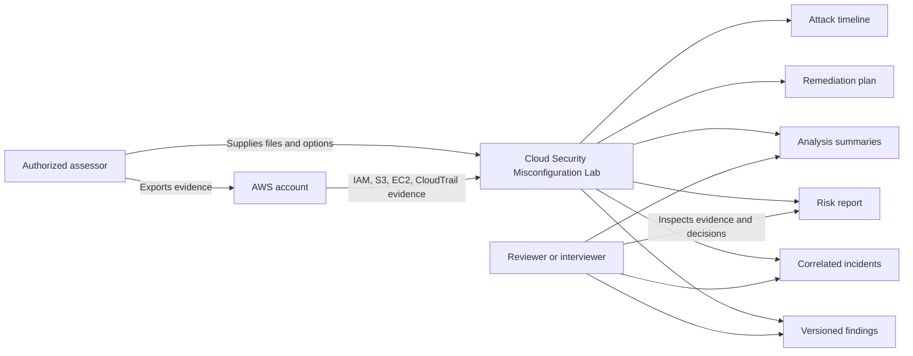
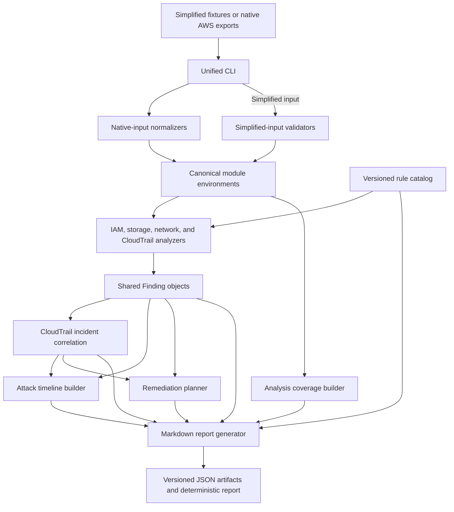

# Architecture

Cloud Security Misconfiguration Lab is an offline evidence-analysis pipeline.
It accepts documented AWS exports or simplified lab fixtures, normalizes them
into stable analyzer inputs, emits explainable security artifacts, and combines
those artifacts into a deterministic report.

The runtime never authenticates to AWS, changes cloud resources, or requires a
network connection.

## System Context

The assessor remains responsible for authorized collection and for deciding
whether the supplied evidence represents a complete account snapshot. The lab
analyzes files; it does not establish collection authority or freshness.

## Processing Pipeline

1. The CLI selects a module, input format, and explicit analysis parameters.
2. A bounded reader limits external bytes, gzip expansion, JSON nodes and
   depth, resources, and related files. Native adapters then validate
   AWS-shaped evidence and translate it into a canonical module environment.
   Simplified files cross a dependency-free, path-aware validator before
   entering the same canonical boundary.
3. An analyzer applies module-specific rules and emits shared `Finding`
   objects with stable IDs, confidence, account, Region, time, and structured
   source references. CloudTrail analysis can also correlate eligible findings
   into `Incident` objects.
4. The coverage builder records discovered and evaluated resources, warnings,
   skipped evidence, and result counts independently from risk findings.
5. The report loader rejects unsupported versions and count mismatches before
   combining artifacts.
6. Timeline and remediation builders derive chronological and prioritized
   views while preserving links to the source findings and incidents.
7. A fixed report date makes the complete sample pipeline byte-for-byte
   reproducible.

## Component Boundaries

| Component | Responsibility | Does Not Do |
| --- | --- | --- |
| `cloud_security_lab.cli` | Command parsing and pipeline orchestration | Detection logic |
| `cloud_security_lab.normalizers` | Strict native AWS parsing and canonical translation | Live AWS collection |
| `cloud_inputs` | External-file resource bounds plus simplified-input structure, type, and compatibility validation | Detection or full JSON Schema evaluation |
| `iam_analyzer` | Identity policy, trust, boundary, and credential checks | Full IAM authorization evaluation |
| `storage_analyzer` | S3 public-access, ownership, encryption, and versioning checks | Object inventory or access-point analysis |
| `network_analyzer` | Security-group exposure and supplied reachability context | Independent end-to-end path calculation |
| `cloudtrail_detector` | Selected audit-event rules and bounded incident correlation | Behavioral baselining or attribution |
| `cloud_findings` | Shared finding model and JSON I/O | Module-specific interpretation |
| `cloud_incidents` | Correlated incident model and JSON I/O | Correlation policy |
| `cloud_analysis` | Coverage and evidence-gap model | Risk scoring |
| `cloud_rules` | Built-in rule metadata, confidence, and qualified mappings | Detector execution |
| `cloud_remediation` | Explainable P0-P3 response and hardening queue | Autonomous changes |
| `cloud_timeline` | Chronology, omissions, and incident narrative context | Causal inference |
| `report_generator` | Cross-artifact validation and Markdown rendering | Evidence collection |

Dependencies point from orchestration and derived views toward shared models.
The shared finding model does not import analyzers or the CLI, which prevents
reporting concerns from becoming detector dependencies.

The report renderer is also a trust boundary. Finding, incident, analysis
summary, remediation, timeline, and source-path text is treated as artifact
data rather than Markdown. Context-aware rendering preserves the fixed report
structure; see [Markdown report integrity](report-integrity.md).

## Artifact Contracts

The pipeline uses explicit, versioned JSON boundaries:

| Boundary | Contract |
| --- | --- |
| Canonical analyzer inputs | IAM, storage, network, and CloudTrail environment schemas |
| Supported native exports | IAM authorization, S3 evidence bundle, EC2 security groups, and CloudTrail record schemas |
| Analyzer results | Findings v2 and analysis-summary schemas |
| Correlation results | Incident schema |
| Rule metadata | Rule-catalog schema |
| Derived views | Remediation-plan and attack-timeline schemas |
| Bundled AWS-shaped evidence | Sanitized fixture-manifest schema |

Python loaders enforce cross-field invariants that JSON Schema cannot express
conveniently, such as declared-count equality, deterministic ordering, complete
source accounting, UTC ordering, and work-item linkage. Draft 2020-12 schema
validation remains a development and CI gate.

See [Data contracts](data-contracts.md) for the complete contract index.

## Trust and Failure Boundaries

The architecture treats absence of evidence differently from a secure value:

- Truncated, malformed, conflicting, or structurally incomplete native exports
  stop analysis when continuing could create a misleading result.
- Supported but unavailable evidence is recorded as a warning or structured
  skipped-evidence item.
- Coverage status is calculated separately from finding count.
- Timeline candidates without usable chronological evidence become explicit
  omissions.
- Incident and remediation linkage uses exact evidence keys rather than time or
  title similarity.
- A zero-finding report never claims that an environment is secure.

Input files are trusted only as supplied evidence. The lab does not verify
CloudTrail digest signatures, provenance, collection authorization, or whether
files were altered before analysis.

The exact fail-closed byte, decompression, node, nesting, resource, and
file-count ceilings are documented in
[Input resource limits](input-resource-limits.md).

The complete actor, asset, abuse-case, development-network, local-filesystem,
and release-signing analysis is maintained in the
[Threat model](threat-model.md). Security reports follow the repository
[Security policy](../SECURITY.md).

## Determinism

Determinism makes the repository reviewable and testable:

- Findings, incidents, summaries, rules, remediation actions, and timeline
  entries use stable sort keys.
- Finding, incident, remediation, and timeline IDs use SHA-256 digests over
  canonical identity fields.
- Generated JSON uses stable field and list ordering.
- Implicit runtime timestamps are excluded from machine-readable artifacts;
  explicit evidence observation times are preserved.
- The sample report receives an explicit report date.
- CI regenerates the report and rule catalog and compares them byte-for-byte
  with committed references.

Stable IDs identify the same evidence, not an indefinitely mutable case.
Changing a material input changes the derived ID.

## Packaging and Execution

The package requires Python 3.10 or later and has no third-party runtime
dependencies. Optional development dependencies provide JSON Schema
validation, linting, static typing, branch coverage, and distribution builds.

The wheel contains:

- All analyzer, model, CLI, and reporting packages
- The built-in rule catalog
- The benchmark runner and committed expectation manifest
- Versioned JSON Schemas
- Simplified and AWS-shaped sample evidence

The installed `cloud-security-lab` command and `python -m cloud_security_lab`
entry point expose the same `analyze`, `report`, `catalog`, and `demo`
subcommands. Original module scripts remain compatibility entry points.

Tagged releases cross a separate delivery boundary. A read-only build job
tests and packages the project, inventories an isolated wheel installation,
validates checksums and SPDX identity, and signs provenance through GitHub
OIDC. A second job receives only the verified candidate, repeats checksum and
attestation verification, and holds the permission to create the GitHub
Release. See [Release integrity](release-integrity.md).

## Extension Path

Adding a built-in rule requires:

1. Implementing the detector condition in the owning analyzer.
2. Registering the rule, allowed severities, confidence basis, and qualified
   mappings in `cloud_rules/rules-v1.0.json`.
3. Adding positive, negative, boundary, malformed, and rule-interaction tests.
4. Updating sample evidence only when the sample narrative benefits.
5. Adding the rule-specific positive and boundary benchmark profiles.
6. Regenerating and reviewing the catalog, benchmark manifest, and
   deterministic report.

Adding a new analyzer also requires a canonical input contract, a shared
finding output, analysis-summary coverage rules, CLI registration, packaging,
and end-to-end tests. Report generation remains module-neutral because it
consumes shared artifacts rather than analyzer internals.

## Quality Attributes

The architecture prioritizes:

- **Explainability:** every result carries evidence, impact, remediation, and
  rule context.
- **Evidence integrity:** missing evidence is visible and count mismatches fail.
- **Reproducibility:** deterministic outputs support review and regression
  testing.
- **Safety:** offline analysis cannot modify a cloud account.
- **Compatibility:** native adapters and legacy scripts converge on stable
  analyzer interfaces.
- **Extensibility:** shared contracts allow new rules and modules without
  rewriting report assembly.

The tradeoff is deliberately limited breadth. The lab favors defensible claims
over pretending to be a complete cloud security platform.
