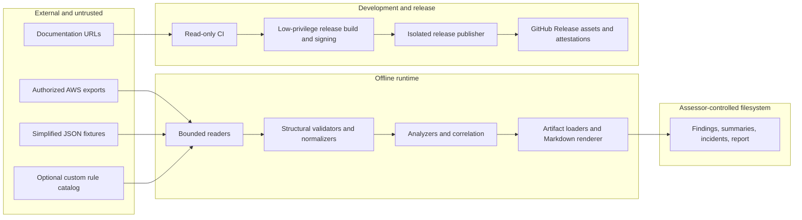

# Threat Model

This document defines the security boundary for Cloud Security
Misconfiguration Lab. It models the offline analyzer runtime, its local
artifacts, the development pipeline, and tagged releases. It does not convert
the lab into a live cloud-security service or claim complete AWS policy
evaluation.

Review this model when an input contract, analyzer, dependency, output format,
network behavior, CI permission, or release mechanism changes.

## System and Trust Boundaries

The runtime has no AWS SDK, cloud credentials, database, telemetry, or required
network path. It reads files selected by the assessor and writes plaintext
artifacts to paths selected by the assessor. Development link checks and
release signing use the network but are outside analyzer execution.

## Assets and Security Objectives

| Asset | Objective |
| --- | --- |
| Supplied AWS evidence | Do not modify it, transmit it, or silently reinterpret malformed content. |
| Findings and coverage artifacts | Preserve schema, source accounting, stable identity, and deterministic ordering. |
| Markdown report | Preserve the fixed document structure when artifact text is adversarial. |
| Rule catalog and custom rules | Reject unsupported structure and make the active rule source visible. |
| Local machine | Bound parser work and avoid path escape, unsafe link following, or unintended cloud actions. |
| Source and release artifacts | Make dependency inputs, checksums, software inventory, builder identity, and signer workflow independently reviewable. |

The principal objectives are fail-closed parsing, bounded resource use,
evidence integrity, non-mutation, deterministic output, least-privilege
delivery, and claims that remain inside measured coverage.

## Actors and Assumptions

- The assessor is authorized to possess and analyze the supplied evidence.
- Input files, custom catalogs, and loaded report artifacts may be malformed or
  intentionally adversarial.
- The local operating system, Python interpreter, command arguments, and chosen
  output directory are controlled by the assessor.
- GitHub-hosted runners, GitHub identity, Sigstore trusted roots, PyPI, and
  reviewed third-party release tools remain upstream trust dependencies.
- A maintainer able to change the repository or release workflow can change
  analyzer behavior. Attestation proves which workflow and commit built an
  artifact; it does not prove that the source was benign.

## Threats and Controls

| ID | Threat or abuse case | Primary controls | Residual risk |
| --- | --- | --- | --- |
| TM-01 | Schema confusion or malformed nested values reach detection logic. | Path-aware simplified validators, strict native normalizers, versioned schemas, and negative tests. | Semantic AWS combinations outside the consumed contract are not modeled. |
| TM-02 | Large JSON, deep nesting, excessive nodes, many resources, or gzip expansion exhausts memory or CPU. | Bounded reads, pre-parse depth checks, post-parse node checks, aggregate budgets, file limits, and adversarial tests. | Inputs inside the ceilings can still consume meaningful resources; analysis is not streaming. |
| TM-03 | A supplied path or symlink escapes the intended release or artifact boundary. | Direct-child release inventory, basename-only manifests, symlink rejection, safe CLI output handling, and isolated workflow directories. | The general CLI trusts assessor-selected output paths; operating-system races are not eliminated. |
| TM-04 | Artifact text injects headings, tables, links, or code into the report. | Context-aware escaping for prose, headings, table cells, code spans, links, and paths plus one cross-artifact adversarial corpus. | A downstream non-Markdown renderer may apply different interpretation rules. |
| TM-05 | Evidence is altered, stale, filtered, unauthorized, or incomplete before analysis. | Provenance fields, fixture hashes, explicit coverage states, skipped-evidence records, collection guidance, and no secure-on-zero claim. | The lab does not verify CloudTrail digest signatures, collection authorization, freshness, or account-wide completeness. |
| TM-06 | A custom catalog or built-in rule change creates misleading results. | Strict catalog contract, rule-ID completeness tests, qualified mappings, benchmark expectations, and visible custom-catalog provenance. | A valid but malicious custom catalog can intentionally change severities or explanations. |
| TM-07 | Rule gaps or correlation are mistaken for complete security or attacker attribution. | Known limitations, evidence-based confidence, separate coverage status, timeline omissions, and non-causal incident wording. | False positives and false negatives remain possible within supported inputs. |
| TM-08 | A dependency, GitHub Action, or build backend changes without review. | Zero runtime dependencies, hash-locked development graph, no isolated build resolution, full-SHA Action pins, and executable pin tests. | Runner images, Python patch releases, pip, GitHub, PyPI availability, and reviewed upstream releases remain dependencies. |
| TM-09 | External-link validation accesses private services or is redirected to them. | HTTP-only schemes, credential and port rejection, public-address DNS checks, redirect revalidation, bounded concurrency, timeouts, and retries. | DNS can change between validation and connection; the checker is a development tool, not a hardened crawler. |
| TM-10 | A release asset is substituted, mixed with stale files, or paired with an unrelated SBOM. | Exact one-wheel/one-sdist/one-SBOM inventory, filename and SPDX identity validation, SHA-256 manifest, signed SLSA provenance, signed SBOM predicate, signer-workflow verification, and post-transfer revalidation. | Checksums alone are not signatures; consumers must verify the Sigstore attestation to establish origin. |
| TM-11 | Sensitive evidence is exposed through generated local artifacts. | Offline execution, ignored generated directory, sanitized committed fixtures, privacy review, and no telemetry. | Findings, reports, and normalized evidence are plaintext and inherit local filesystem protections. |
| TM-12 | Analysis unexpectedly authenticates to AWS or changes cloud state. | No AWS SDK or runtime dependency, file-only adapters, documented collection separation, and offline end-to-end tests. | User-written wrappers or future collectors are outside this guarantee and require a new threat-model review. |

## Release Trust Chain

The tagged release path separates authority:

1. A low-privilege job checks out source without persisted credentials, repeats
   all quality gates, builds the distributions, installs the wheel into an
   isolated SBOM root, and validates the generated SPDX inventory.
2. The same job writes and rechecks `SHA256SUMS`, then uses GitHub OIDC and
   Sigstore to attest the wheel, source distribution, SBOM, and checksum file.
3. It creates a separate SPDX SBOM attestation for the wheel and verifies both
   signed bundles against the exact release workflow identity.
4. An immutable workflow artifact crosses into a second job. That job has
   release-write permission but does not check out source or execute project
   Python; it rechecks hashes and attestations before creating the release.

This design produces provenance evidence. It does not claim a particular SLSA
build level or a hermetic, bit-for-bit reproducible environment.

## Verification Evidence

| Control | Executable evidence |
| --- | --- |
| Runtime structure and resource bounds | Simplified-input, native-adapter, and `cloud_inputs` adversarial tests |
| Report structure | Cross-artifact Markdown integrity regression |
| Rule and contract completeness | Catalog, schema, benchmark, and deterministic-output gates |
| Dependency and Action pins | `tests/test_supply_chain.py` |
| Release inventory, SPDX identity, and checksum behavior | `tests/test_release_evidence.py` and `tools/release_evidence.py` |
| Public artifact origin | `gh attestation verify` with repository, predicate, bundle, and signer-workflow constraints |

See [Release integrity](release-integrity.md) for consumer commands and
[Known limitations](known-limitations.md) for analyzer-specific residual risk.

## Review Triggers

Re-evaluate this model before adding live AWS collection, credentials, a
service endpoint, persistent storage, automatic remediation, user-supplied
plugins, a new package ecosystem, a different report renderer, self-hosted
runners, or a reusable release builder. Each would add a trust boundary or
change who can influence signed output.

## References

- [OWASP Threat Modeling](https://owasp.org/www-community/Threat_Modeling)
- [GitHub artifact attestations](https://docs.github.com/en/actions/concepts/security/artifact-attestations)
- [SLSA build provenance](https://slsa.dev/spec/v1.2/provenance)
